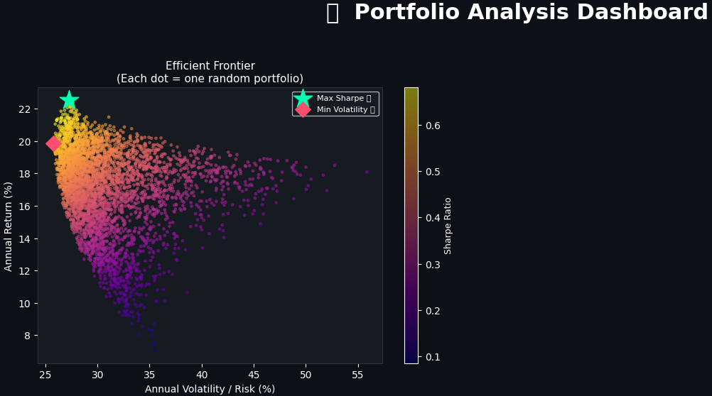

# Quantitative Portfolio Analyser & Optimizer

A Python-based financial tool that implements **Modern Portfolio Theory (MPT)** to find optimal asset allocations. This project uses Monte Carlo simulations to identify the Efficient Frontier and maximize risk-adjusted returns (Sharpe Ratio).

## 🚀 Key Features
* **Automated Data Pipeline:** Fetches real-time financial data via the `yfinance` API.
* **Risk/Return Modeling:** Calculates annualized volatility and returns for multi-asset portfolios.
* **Monte Carlo Simulation:** Simulates 4,000+ random portfolios to find the optimal weights.
* **Interactive Dashboard:** 
  * **Efficient Frontier:** Visualizes the risk-return spectrum.
  * **Correlation Heatmap:** Analyzes asset diversification.
  * **Growth Analysis:** Compares optimal portfolio performance against individual assets.

## 🛠️ Tech Stack
* **Language:** Python
* **Libraries:** Pandas, NumPy, Matplotlib, Seaborn, yfinance

## 📈 Methodology
The project follows a standard quantitative finance workflow:
1. **Log Returns:** Used for statistical stationarity in financial time series.
2. **Optimization:** Maximizing the **Sharpe Ratio** ($S_p = \frac{R_p - R_f}{\sigma_p}$) relative to a 4% risk-free rate.
3. **Diversification:** Correlation matrices are used to minimize unsystematic risk.

## 🏃 How to Run
1. Click the **"Open in Colab"** badge at the top of the notebook.
2. Update the `TICKERS` list in the second cell to analyze your own assets.
3. Select **Runtime > Run all**.
