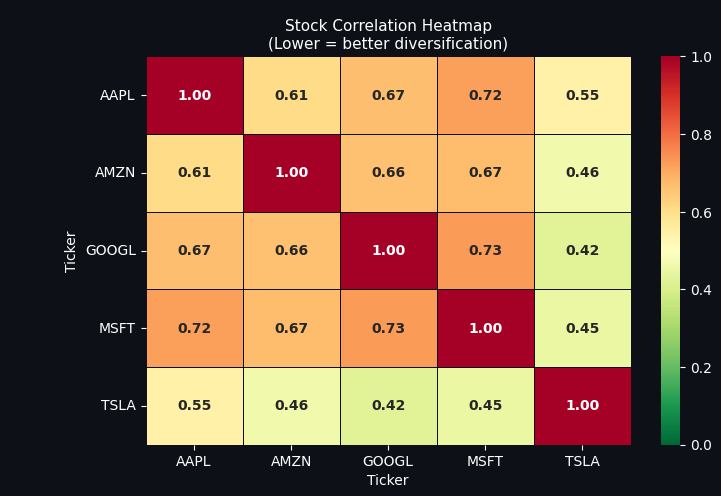

# Portfolio Optimizer & Risk Analyser

A Python project that analyses a stock portfolio using Modern Portfolio Theory. It downloads real stock price data, calculates risk and return metrics, runs a Monte Carlo simulation to find the best portfolio, and displays the results in 4 charts.

This was built as a beginner finance + Python project. No prior knowledge of either was needed to complete it.

---

## What it does

- Downloads 3 years of historical stock prices from Yahoo Finance (free, no API key needed)
- Calculates the annual return, volatility (risk), and Sharpe Ratio for each stock
- Runs 4,000 random portfolio weight combinations (Monte Carlo simulation) to find the best mix
- Plots 4 charts in a single dashboard and saves them as a PNG file

---

## The 4 charts

**1. Efficient Frontier** — Scatter plot of all 4,000 random portfolios. Each dot is one possible way to split money across the 5 stocks. The green star marks the best portfolio (highest Sharpe Ratio). The pink diamond marks the least risky one.


**2. Sharpe Ratio bar chart** — Ranks each stock by its Sharpe Ratio (return divided by risk). Higher = better. The dashed line at 1.0 is the benchmark — stocks above it are performing well on a risk-adjusted basis.

**3. $10,000 growth chart** — Shows how a $10,000 investment would have grown over 3 years. Faint lines = individual stocks. Bright green line = the optimal portfolio mix. Demonstrates the effect of diversification.

**4. Correlation heatmap** — Shows how closely each pair of stocks moves together. Values close to 1.0 mean they move together (risky). Values closer to 0 mean they move independently (better diversification).


---

## Key metrics used

| Metric | What it means |
|---|---|
| Annual Return | Average yearly profit/loss as a percentage |
| Annual Volatility | How much the price swings up and down per year (risk) |
| Sharpe Ratio | Return divided by risk. Higher = better. Above 1.0 is good |
| Correlation | How similarly two stocks move. Lower = more diversified |

---

## Tech used

- Python 3
- `yfinance` — downloads stock data
- `pandas` — data cleaning and manipulation
- `numpy` — maths and matrix calculations
- `matplotlib` — charts
- `seaborn` — heatmap

---

## How to run it

**Install the libraries**
```bash
pip install yfinance pandas numpy matplotlib seaborn
```

**Run the script**
```bash
python portfolio_analyzer.py
```

Charts will appear on screen and save as `portfolio_dashboard.png`.

---

## How to customise it

At the top of `portfolio_analyzer.py`, change these values:

```python
TICKERS            = ["AAPL", "MSFT", "TSLA", "GOOGL", "AMZN"]  # any stocks you want
START_DATE         = "2021-01-01"
END_DATE           = "2024-01-01"
INITIAL_INVESTMENT = 10000   # change to any starting amount
```

---

## Methodology

1. **Pulled the data** — Used `yfinance` to download daily closing prices for 5 stocks over 3 years. Removed any days with missing data (market holidays etc).

2. **Calculated daily returns** — Divided each day's price by the previous day's price to get a percentage change. This tells us how much each stock moved day to day.

3. **Scaled to yearly numbers** — Multiplied average daily return by 252 (trading days in a year) to get annual return. Multiplied daily volatility by √252 to get annual volatility.

4. **Calculated the Sharpe Ratio** — Subtracted the risk-free rate (4%) from each stock's annual return, then divided by its volatility. This gives a single score for how much return you're getting per unit of risk.

5. **Built the covariance matrix** — Used pandas to calculate how each pair of stocks moves together. This is the key input for calculating portfolio-level risk (not just individual stock risk).

6. **Ran the Monte Carlo simulation** — Generated 4,000 random sets of portfolio weights (each set sums to 100%). For each one, calculated the portfolio's return, volatility, and Sharpe Ratio using the covariance matrix. Stored all results.

7. **Found the best portfolios** — Scanned all 4,000 results to find the one with the highest Sharpe Ratio (best risk-adjusted return) and the one with the lowest volatility (least risky).

8. **Plotted the dashboard** — Used Matplotlib's GridSpec to lay out 4 charts in one figure. Saved the output as a PNG file.

---

## What I learned

- How to use an API to pull real financial data
- How to calculate returns and risk from raw price data
- What the Sharpe Ratio means and why it's useful
- How Monte Carlo simulation works at a basic level
- How to build a multi-chart dashboard with Matplotlib
